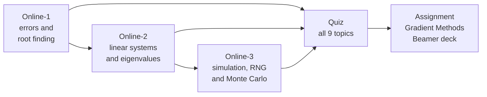

<div align="center">

# CSE 402 · Numerical Analysis, Simulation and Modeling Sessional

**My code, notes and submissions for CSE 402: three online lab exams, the quiz, and the assignment.**


[Online-1](#online-1--errors-and-root-finding) ·
[Online-2](#online-2--linear-systems-and-eigenvalues) ·
[Online-3](#online-3--simulation-random-numbers-and-monte-carlo) ·
[Quiz](#quiz--formula-sheet-and-practice-booklet) ·
[Assignment](#assignment--gradient-methods-beamer-deck)

</div>

---

## The course in one picture



| Part | What it covered | Where to start |
|---|---|---|
| [Online-1](Online-1/) | round-off and truncation error, bisection, false position (Illinois), Newton-Raphson, Bairstow | [`codes/README.md`](Online-1/codes/README.md) |
| [Online-2](Online-2/) | Gauss elimination, Gauss-Jordan, LU, power and inverse power method, deflation, eigendecomposition | [`code/README.md`](Online-2/code/README.md) |
| [Online-3](Online-3/) | discrete-event simulation, random number generators and their tests, Monte Carlo, Metropolis-Hastings | [`STUDY_GUIDE.md`](Online-3/STUDY_GUIDE.md) |
| [Quiz](Quiz/) | all nine theory topics, from errors to RNG and Monte Carlo | [`notes/formulas_master.pdf`](Quiz/notes/formulas_master.pdf) |
| [Assignment](Assignment/) | Topic 3, Gradient Methods: a full teaching deck with 10 solved problems | [`2105032.pdf`](Assignment/2105032.pdf) |

The online exams were open-material coding tests, so most folders are built around one question:
*what can I open on exam day and run in under a minute?* That's why each one has exam templates
next to the cleaner reference code.

---

## Online-1 · Errors and root finding

Lab exam on how numbers go wrong in a computer and how to find where a function crosses zero.

**Topics:** approximate vs. true error, machine epsilon, round-off vs. truncation and the step-size
trade-off, bisection, false position with the Illinois fix for stagnation, Newton-Raphson with
multiplicity correction and cycle detection, Bairstow's method for real and complex polynomial roots.

| Folder | What's in it |
|---|---|
| [`codes/methods/`](Online-1/codes/methods/) | one clean implementation per method (bisection and false position, Newton-Raphson, Bairstow) |
| [`codes/basic/`](Online-1/codes/basic/) | error analysis, plotting helpers, the V-shaped error trade-off plot, a root scanner |
| [`codes/online-template/`](Online-1/codes/online-template/) | the exam-day starter: define `f` and `df` once, then call the solver the question needs |
| [`codes/cheatsheets/`](Online-1/codes/cheatsheets/) | a short exam cheatsheet and a longer master version |
| [`codes/docs/`](Online-1/codes/docs/) | study guides for both slide decks, plus deep dives on Newton-Raphson and Bairstow |
| [`codes/practice-online/`](Online-1/codes/practice-online/) | six harder practice problems (diode breakdown, RLC circuit, Illinois vs. plain false position) with a question bank |
| [`codes/prev-section/`](Online-1/codes/prev-section/), [`prev-section-redo/`](Online-1/codes/prev-section-redo/), [`prev-year-redo/`](Online-1/codes/prev-year-redo/) | other sections' and previous years' questions, solved and then re-solved |
| [`references/`](Online-1/references/) | condensed slide content used as the ground truth for formulas |

<details>
<summary><b>Formula notes: bisection, false position, Newton-Raphson, Bairstow, error trade-off</b></summary>

### Bisection

A bracketing method that halves the interval $[x_L, x_U]$ with $f(x_L)\,f(x_U) < 0$:

$$x_r = \frac{x_L + x_U}{2}$$

If $f(x_L)\,f(x_r) < 0$ the root is in the left half ($x_U \leftarrow x_r$), otherwise in the right half ($x_L \leftarrow x_r$).
The approximate relative error is

$$\varepsilon_a = \left| \frac{x_r^{\text{new}} - x_r^{\text{old}}}{x_r^{\text{new}}} \right| \times 100\%$$

and it needs a guard for roots at zero:

```python
if abs(xr_new) < 1e-12:
    ea = abs(xr_new - xr_old) * 100.0
else:
    ea = abs((xr_new - xr_old) / xr_new) * 100.0
```

### False position and the Illinois fix

The secant through $(x_L, f(x_L))$ and $(x_U, f(x_U))$ crosses the axis at

$$x_r = x_U - \frac{f(x_U)(x_L - x_U)}{f(x_L) - f(x_U)}$$

On a convex or concave stretch one endpoint never moves and convergence crawls. The Illinois
variant halves the stuck endpoint's function value:

```python
if fl * fxr < 0:
    xu, fu = xr, fxr
    fl = fl / 2.0   # the left end is stuck: shrink its weight
else:
    xl, fl = xr, fxr
    fu = fu / 2.0   # the right end is stuck: shrink its weight
```

### Newton-Raphson

$$x_{i+1} = x_i - m \frac{f(x_i)}{f'(x_i)}$$

$m = 1$ for a simple root. For a root of multiplicity $m > 1$, using that $m$ brings back quadratic
convergence; without it the method slows to linear. Newton can also cycle ($0 \to 1 \to 0 \to \dots$),
so the code keeps a history and stops when a value repeats:

```python
for past_x in history[:-1]:
    if abs(x_new - past_x) < 1e-6:
        print("Warning: infinite oscillation loop detected.")
        break
```

### Bairstow

Pulls quadratic factors $x^2 - r x - s$ out of a degree-$n$ polynomial with two synthetic divisions:

$$b_0 = a_0,\quad b_1 = a_1 + r b_0,\quad b_i = a_i + r b_{i-1} + s b_{i-2}$$
$$c_0 = b_0,\quad c_1 = b_1 + r c_0,\quad c_i = b_i + r c_{i-1} + s c_{i-2}$$

The corrections solve

$$\begin{bmatrix} c_{n-2} & c_{n-3} \\ c_{n-1} & c_{n-2} \end{bmatrix} \begin{bmatrix} \Delta r \\ \Delta s \end{bmatrix} = \begin{bmatrix} -b_{n-1} \\ -b_n \end{bmatrix}$$

and each factor gives $x = \dfrac{r \pm \sqrt{r^2 + 4s}}{2}$.

### Truncation vs. round-off

For $f'(x) \approx \frac{f(x+h)-f(x)}{h}$, truncation error shrinks like $O(h)$, while round-off grows
as $h \to 0$ because subtracting nearly equal numbers loses digits, and dividing by $h$ magnifies the loss.
The total error is V-shaped, with the best step near $h \approx 10^{-8}$ in double precision.

</details>

---

## Online-2 · Linear systems and eigenvalues

Lab exam on solving $A\mathbf{x} = \mathbf{b}$ and finding eigenpairs, mostly by hand-written loops
that are then checked against `np.linalg`.

**Topics:** Gauss elimination with partial pivoting, classifying systems (unique, infinite, none),
Gauss-Jordan to RREF and inverses, LU decomposition and reusing it for several right-hand sides,
determinants, the power method, the inverse power method, deflation for the middle eigenvalues,
characteristic polynomials and full eigendecomposition.

| Folder | What's in it |
|---|---|
| [`code/algorithms/`](Online-2/code/algorithms/) | the reference implementations everything else builds on, one file per topic |
| [`code/templates/`](Online-2/code/templates/) | exam-ready scripts: paste in the question's matrix and run |
| [`code/docs/`](Online-2/code/docs/) | one note per algorithm, covering both the maths and why the code looks the way it does |
| [`code/practice/`](Online-2/code/practice/) | 13 timed mock questions with solutions, plus a statements-only file for blind practice |
| [`code/complex_cases/`](Online-2/code/complex_cases/) | the nasty variants: singular and rank-deficient systems, ill-conditioning, complex or tied eigenvalues |
| [`code/prev-solutions/`](Online-2/code/prev-solutions/) | solutions to the five past questions, grouped by method |
| [`code/cheatsheet.md`](Online-2/code/cheatsheet.md) | one page of NumPy syntax and quick theory answers |
| [`study-guide.md`](Online-2/study-guide.md) | the topic-by-topic study guide |

**Submitted solution:** [`2105032.py`](Online-2/2105032.py) solves a system with two right-hand sides
two ways, by Gauss-Jordan on $[A \mid b_1\ b_2]$ and by one LU factorisation reused for both, and
prints the results side by side.

---

## Online-3 · Simulation, random numbers and Monte Carlo

Lab exam on simulating systems that involve chance, and on checking that the random numbers
behind them are any good.

**Topics:** discrete-event simulation of a single-server queue, steps of a simulation study,
model validation, random number generators (LCG, RANDU, middle-square) and their periods,
uniformity and independence tests (chi-square, Kolmogorov-Smirnov, runs, autocorrelation),
inverse-transform sampling, Monte Carlo integration and hit-or-miss, Buffon's needle, and Metropolis-Hastings.

| Folder | What's in it |
|---|---|
| [`Code/`](Online-3/Code/) | a small library: `rng/`, `testing/`, `monte_carlo/`, `simulation/`, `variate_generation/`, `viz/` |
| [`Code/solutions/`](Online-3/Code/solutions/) | worked solutions (Buffon's needle, network reliability, middle-square, hidden LCG period) and two sets of practice problems |
| [`Code/cheatsheets/`](Online-3/Code/cheatsheets/) | Python, NumPy, `random` and SciPy syntax in one place |
| [`Code/prac/`](Online-3/Code/prac/) | the practice question PDFs with solution scripts and two notebooks |
| [`versions/templates/`](Online-3/versions/templates/) | eleven numbered exam templates, from an LCG period check to discrete-event simulation variants |
| [`STUDY_GUIDE.md`](Online-3/STUDY_GUIDE.md), [`STUDY_ORDER.md`](Online-3/STUDY_ORDER.md) | what to study, and in which order |
| [`Practice/`](Online-3/Practice/) | extra practice questions |

**Submitted solution:** [`Code/2105032.py`](Online-3/Code/2105032.py) has an event-driven single-server queue
simulator (heap-based event list, optional trace). It also includes a RANDU generator with a cycle
finder, exponential variates, and a steady-state run that drops the warm-up period before
estimating utilisation and the average number in the system.

To set up the environment:

```bash
cd Online-3/Code
python -m venv .venv
.venv\Scripts\Activate.ps1        # Windows PowerShell (macOS/Linux: source .venv/bin/activate)
python -m pip install -r requirements.txt
```

---

## Quiz · Formula sheet and practice booklet

Two LaTeX documents that cover every theory topic in the course:

- [`formulas_master.pdf`](Quiz/notes/formulas_master.pdf) is the formula sheet: an at-a-glance page,
  one section per topic, a "beyond the slides" part for each group of topics, and a final comparison of methods.
- [`practice_master.pdf`](Quiz/notes/practice_master.pdf) is the practice booklet: derivations and worked
  simulations, then an MCQ bank with multi-step and trap questions, then a 60-minute mock quiz with an answer key.

| # | Topic | # | Topic |
|---|---|---|---|
| 1 | Errors and approximations | 6 | Regression |
| 2 | Root finding | 7 | Interpolation |
| 3 | Systems of linear equations | 8 | Simulation |
| 4 | Eigenvalues and eigenvectors | 9 | Random numbers and Monte Carlo |
| 5 | Optimization | | |

Each topic lives in its own file under [`notes/parts/`](Quiz/notes/parts/), so a single topic can be fixed and the
booklet rebuilt. The lecture slides used as sources are in [`rsc/`](Quiz/rsc/).

---

## Assignment · Gradient Methods Beamer deck

The allocated topic was number 3 (`032 mod 15 + 1 = 3`): **Gradient Methods**. The brief asked for a
LaTeX Beamer teaching module that goes past the lecture notes, plus ten problems with complete solutions.

**Deliverables:** [`2105032.pdf`](Assignment/2105032.pdf) and
[`2105032_LaTeX_Source.zip`](Assignment/2105032_LaTeX_Source.zip). The editable source is in
[`2105032_LaTeX_Source/`](Assignment/2105032_LaTeX_Source/).

**Part A: theory, in 14 sections.** It starts from the optimisation problem and the steepest-descent
theorem, and the main thread is that gradient descent is forward Euler on the gradient flow. That one
idea explains the step-size limit $\alpha < 2/L$ (Euler's stability interval) and why ill-conditioning
behaves like stiffness. From there it covers:
- convergence proofs for nonconvex, convex, strongly convex and PL functions;
- the zig-zag and the Kantorovich bound, then preconditioning;
- failure modes such as saddles, plateaus, nonsmoothness and finite-difference round-off;
- Armijo and Barzilai-Borwein steps, heavy-ball and Nesterov acceleration with lower bounds;
- SGD, and a short modern section (autodiff, Adam, the edge of stability).

**Part B: ten problems, each followed straight away by a step-by-step solution.**

| Mathematical | Applications |
|---|---|
| M1 stationary points of $x^4+y^4-4xy$ | A1 linear regression and feature scaling ($\kappa$: 46 to 1.5) |
| M2 descent lemma and the nonconvex rate | A2 spring chain at equilibrium, and a stiff support |
| M3 step-size stability on a coupled quadratic | A3 two-product profit maximisation |
| M4 exact line search and the zig-zag, in closed form | A4 Newton's law of cooling, a nonconvex fit with a plateau |
| M5 heavy-ball momentum against plain GD | A5 calibrating a streaming sensor with SGD |

**How it was built:**
- [`scripts/verify_problems.py`](Assignment/2105032_LaTeX_Source/scripts/verify_problems.py) recomputes
  every number in the solutions with assertions, so a typo in a hand calculation fails loudly.
- [`scripts/make_figures.py`](Assignment/2105032_LaTeX_Source/scripts/make_figures.py) draws all the plots.
  They share one visual style and are saved as vector PDFs, so the deck compiles without Python.
- [`build.ps1`](Assignment/build.ps1) builds the PDF and zips the source, then unpacks the zip into an
  empty folder and compiles it again to confirm the submitted source reproduces the submitted PDF.
- The theme is a custom Metropolis setup with three fixed colour jobs (navy, orange, teal), Fira Sans
  and light slides that stay readable on a projector. It is all in
  [`preamble.tex`](Assignment/2105032_LaTeX_Source/preamble.tex).

To rebuild:

```bash
cd Assignment/2105032_LaTeX_Source
pdflatex 2105032 && bibtex 2105032 && pdflatex 2105032 && pdflatex 2105032
```

---

## Running the code

Python 3 with `numpy`, `scipy` and `matplotlib` covers every online folder. The Quiz notes and the
Assignment need a TeX distribution (TeX Live or MiKTeX). Scripts save their plots as `.png` files,
which are git-ignored, so running them won't clutter `git status`.

```bash
python -m pip install numpy scipy matplotlib
python Online-1/codes/methods/04_newton_raphson.py
python Online-2/code/templates/04_power_method.py
python Online-3/Code/solutions/a1_buffons_needle.py
```

## A note on the `res/` folders

Each online folder has a `res/` (or `Res/`) folder with question banks, syllabi and reference code
collected from other sections and earlier years. I kept them for practice; they aren't part of any submission.
